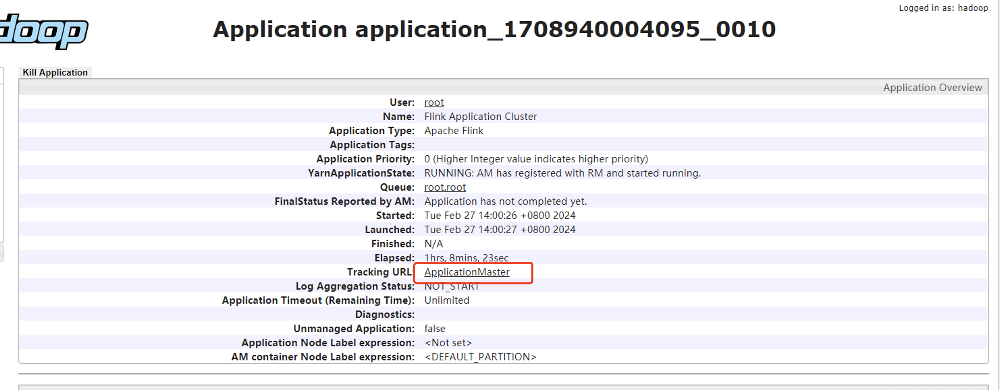
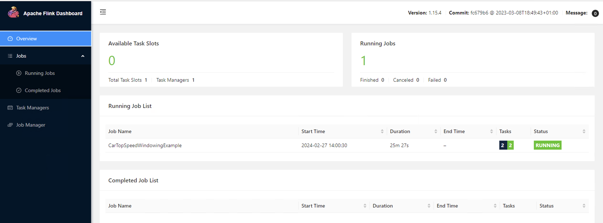
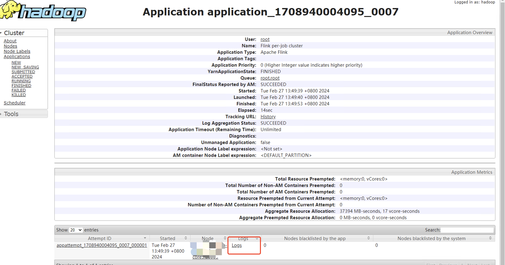

## Flink操作指南

## 1. 基本介绍

**Apache Flink** 是一个在*有界*数据流和*无界*数据流上进行有状态计算分布式处理引擎和框架。Flink 设计旨在*所有常见的集群环境*中运行，以*任意规模*和*内存*级速度执行计算。详细见[Appache Flink](https://flink.apache.org/zh/)。

## 2. 提交作业模式

Flink采用Flink On Yarn 模式部署，您可以SSH登陆UHadoop集群任意节点，在命令行中进行Flink作业提交。

Flink On Yarn模式提供Session、Per-Job Cluster与Application三种模式提交作业，具体说明如下：

| 模式            | 说明                                                         | 优缺点                                                       |
| --------------- | ------------------------------------------------------------ | ------------------------------------------------------------ |
| Session         | 该模式下会创建一个Flink集群，所有作业都将被提交到这个集群上运行，并且该集群在作业运行结束之后不会自动释放。如果某个作业发生异常，导致一个Task Manager关闭，则其他所有运行在该Task Manager上的作业都会失败。 | 优点：提交作业资源分配开销小 。<br/>缺点：作业之间存在资源竞争。<br/>适用场景：部署需要较短启动时间且运行时间相对较短的作业。 |
| Per-Job Cluster | 该模式每次提交一个Flink作业，YARN都会为这个作业新启动一个Flink集群，然后运行该作业。当作业运行结束或者被取消时，该作业所属的Flink集群也会被释放。 | 优点：作业之间资源隔离，一个作业的异常行为不会影响到其他作业。<br/><br/>缺点：启动作业的开销更大。<br/>适用场景：运行时间较长的作业。 |
| Application     | 该模式每次提交一个Flink Application（一个Application包含一个或多个作业），YARN都会为这个Application新启动一个Flink集群。当Application运行结束或者被取消时，该Application所属的Flink集群也会被释放。<br/>该模式与Per-Job模式不同的是，Application对应的JAR包中的main()方法会在集群中的Job Manager中被执行。<br/><br/>如果提交的JAR包中包含多个作业，则这些作业都会在该Application所属的集群中执行。 | 优点：可减轻客户端提交作业时的负担。<br/>缺点：启动作业的开销更大。<br/>适用场景：运行时间较长的作业。 |

## 3. 提交作业

前提：SSH方式登陆集群节点。

### 3.1 Session模式

* 执行以下命令，启动 yarn session

  ```
  yarn-session.sh --detached
  ```

* 执行以下命令，提交作业

  ```
  flink run /home/hadoop/flink/examples/streaming/TopSpeedWindowing.jar
  ```

  提交成功后，会返回作业对应的Yarn ApplicationId（后续步骤会使用到），如下标红字段：

  

### 3.2 Per-Job 模式

* 执行以下命令，提交作业

  ```
  flink run -t yarn-per-job --detached /home/hadoop/flink/examples/streaming/TopSpeedWindowing.jar
  ```

  提交成功后，会返回作业对应的Yarn ApplicationId（后续步骤会使用到），如下标红字段：

  

  如果提交任务出现报错：`Exception in thread "Thread-6" java.lang.IllegalStateException: Trying to access closed classloader. Please check if you store classloaders directly or indirectly in static fields. If the stacktrace suggests that the leak occurs in a third party library and cannot be fixed immediately, you can disable this check with the configuration 'classloader.check-leaked-classloader'.`

  

​       在/home/hadoop/flink/conf/flink-conf.yaml 文件中添加`classloader.check-leaked-classloader: false`重新提交任务即可。

### 3.3 Application 模式

* 执行以下命令，提交作业

  ```
  flink run-application -t yarn-application /home/hadoop/flink/examples/streaming/TopSpeedWindowing.jar
  ```

  提交成功后，会返回作业对应的Yarn ApplicationId（后续步骤会使用到），如下标红字段：


## 4. 作业操作

### 4.1 查看作业

* 通过<master1节点>:23188访问Yarn WebUI，如下。选择对应任务，并点击任务ID，如截图中标红区域。

  

* 进入新页面之后，单击**Tracking URL**的链接：

   

* 进入Flink 页面，可查看作业相关信息。

  

说明：已结束的作业需要通过单独的方式查看日志，具体如下：

* 通过<master1节点>:23188访问Yarn WebUI，如下。选择对应任务，并点击任务ID，如截图中标红区域。

  
  
  即可查看作业日志，如下：
  
  

### 4.2 停止作业

可执行以下命令停止作业：

```
flink cancel -t yarn-application -Dyarn.application.id=<applicationId> <jobId>
```

### 4.3 指定作业配置

可通过以下方式指定作业配置：

* 代码中指定：可在代码中直接指定配置，参考示例如下：

  ```
  // instantiate table environment
  Configuration configuration = new Configuration();
  // set low-level key-value options
  configuration.setString("table.exec.mini-batch.enabled", "true");
  configuration.setString("table.exec.mini-batch.allow-latency", "5 s");
  configuration.setString("table.exec.mini-batch.size", "5000");
  
  ...
  ```

  详细可参考[Flink配置](https://nightlies.apache.org/flink/flink-docs-release-1.15/docs/dev/table/config/)。

* 任务提交命令中设置，可以通过-D指定配置项，如下：

  ```
  flink run-application -t yarn-application -D classloader.check-leaked-classloader=false
  ```

* 修改flink配置文件/home/hadoop/flink/conf/flink-conf.yaml ，修改或者添加配置项。