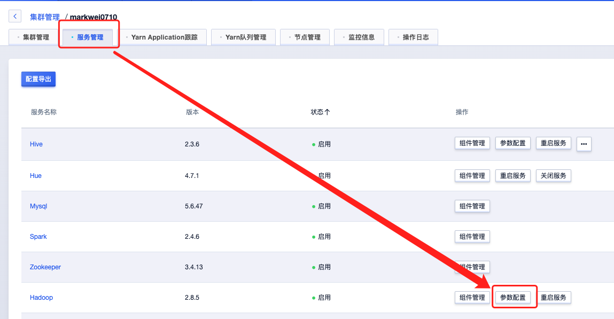
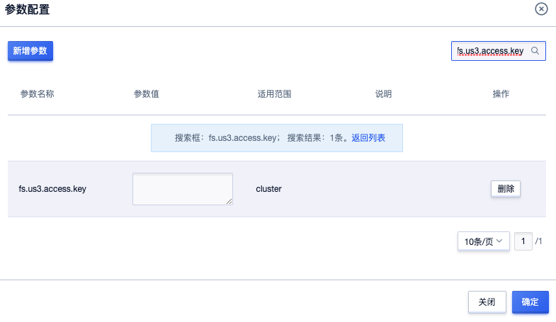

# US3支持（公测中）

说明：

- 当前仅支持乌兰察布可用区，需要使用用户可以联系服务经理开通相关特性使用；
- 仅支持新建的uhadoop-2.2版本实例；

## 1. 使用场景

- 冷数据或者低频计算分析场景
- 小规模计算分析场景
- 数据备份

## 2. 接入步骤

1. UHadoop资源创建：控制台创建hadoop-2.2版本 UHadoop实例（当前仅支持乌兰察布可用区）；

2. US3资源创建：
    - 在US3控制台创建需要使用Bucket，如果已创建可跳过，具体参考：[US3-创建存储空间](https://docs.ucloud.cn/ufile/guide/space?id=%e5%88%9b%e5%bb%ba%e5%ad%98%e5%82%a8%e7%a9%ba%e9%97%b4)
    - 在US3控制台创建令牌关联使用Bucket，如果已创建可跳过，具体参考：[US3-令牌管理](https://docs.ucloud.cn/ufile/guide/token)

3. UHadoop配置修改：

    - 选择已创建UHadoop实例，进入 集群管理->服务管理页面，点击Hadoop->参数陪配置按钮

      

    - 修改US3令牌信息

      - fs.us3.access.key：令牌公钥
      - fs.us3.secret.key：令牌私钥

      操作如下，完成以上两个参数修改之后，点击确定按钮，然后勾选重选提示选项重启Hadoop服务。

      

      

## 3. 使用示例

### 3.1 HDFS

使用格式为`hadoop fs -ls us3://<bucket name>/<path>`。使用示例如下:

* 上传文件

  

* 查看文件列表

  

### 3.2 Hive

可用采用以下两种方式将数据关联US3上。

1. 整个数据库建立在US3上

   ```
   hive (default)> create database hive_us3 location "us3://us3-uhadoop/hive_us3"
   ```

2. 指定表建立在US3上

   ```
   hive (hive_db)> create table us3_test ( name string) row format delimited fields terminated by '\t' location 'us3://sniper-s3-adapter/hive/us3-test';
   ```

### 3.3 Spark

无论是通过spark-submit还是pyspark、spark-shell、spark-sql等读写US3时，需要指定文件路径的格式为: `us3://<bucket name>/path`，如下：

* 上传测试脚本：

  ```
  hadoop fs -put $SPARK_HOME/examples/src/main/python/pi.py us3://us3-uhadoop/example
  ```

* 执行测试：

  ```
  spark-submit --master yarn --deploy-mode client --num-executors 2 --executor-cores 1 --executor-memory 1G us3://us3-uhadoop/example/pi.py 100
  ```


