# 自动伸缩

UHadoop 提供 Task 节点弹性伸缩功能，即能在业务高峰期自动完成 Task 资源扩容，在业务低峰期自动完成 Task 资源缩容，从而达到自动弹性运维，降低成本的目的。

### 注意事项

1.关闭自动伸缩、调整伸缩节点规格、关闭删除策略等操作仅对增量实例生效，已扩容的节点不做调整

2.仅当集群处于运行状态时，策略才会生效

3.多条策略同一时间仅会触发一条
## 开通自动伸缩功能

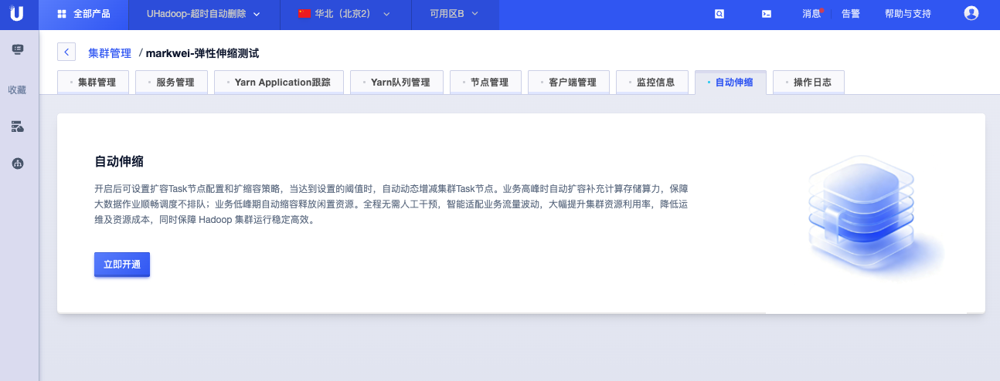

在集群详情页面，进入顶部“自动伸缩”栏，点击下方卡片“立即开通”按钮。

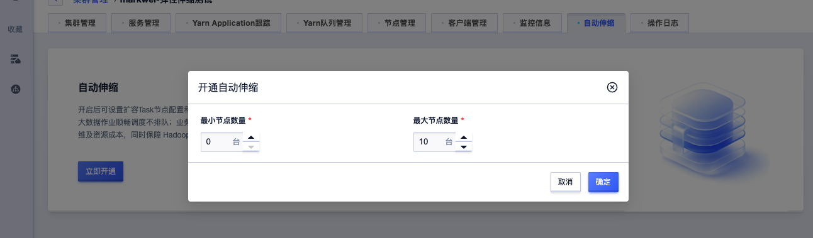

开通时需配置自动伸缩的最小值与最大值，即伸缩节点数量范围。

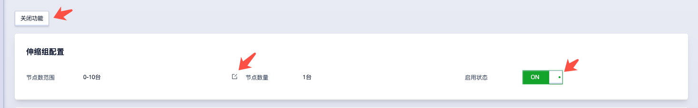

开通后可执行“关闭功能”、修改节点数范围、开关是否启用等操作。

## 设置自动伸缩节点规格

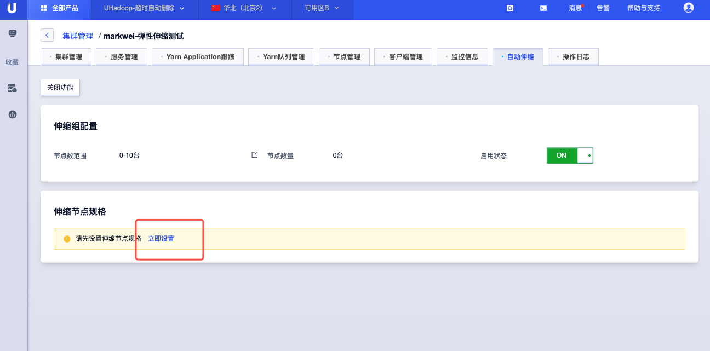

开通后需先进行节点规格设置，点击伸缩节点规格卡片中的”立即设置“。

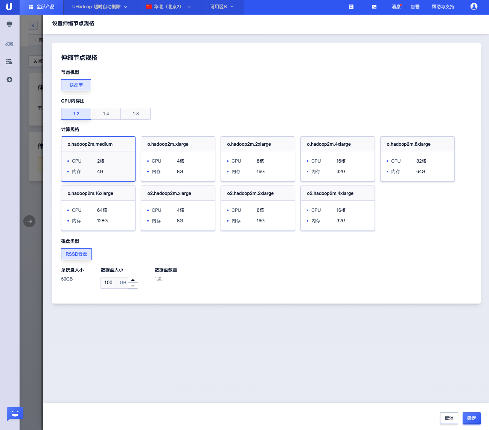

在弹出的抽屉中，选择节点配置后，点击底部确定按钮。

## 配置策略

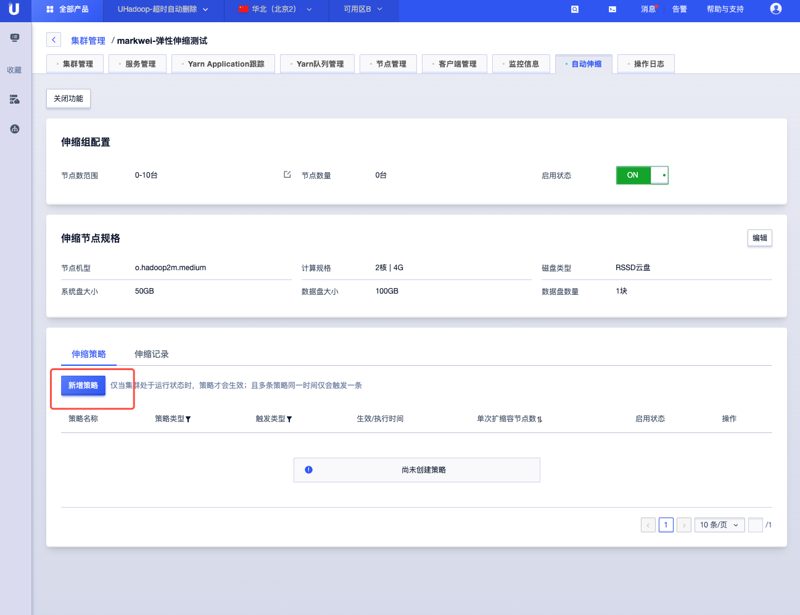

点击“新建策略”可设置自动伸缩的策略。

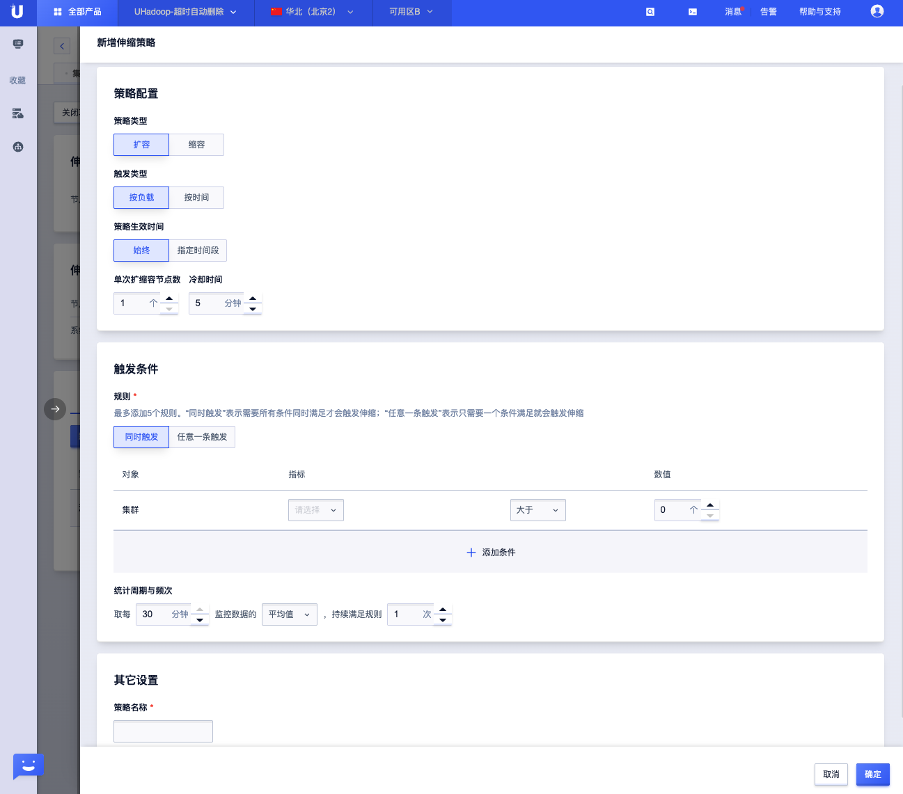

在弹出的抽屉中设置策略配置。

策略总共包含扩容与缩容两种类型，可按负载（即指定指标与触发阈值）与按时（自定义触发时间）。

冷却时间指扩缩容开始后，到下次可执行扩缩容之间的最小间隔时间，以防止重复扩缩。

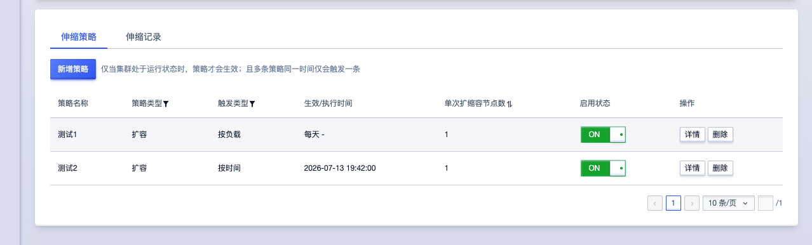

## 策略操作
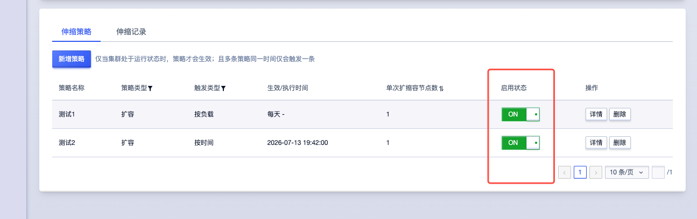

策略可执行开关操作，关闭后该策略不生效。

策略也可执行查看详情与删除操作，如需编辑策略，可在策略详情中操作。

## 伸缩记录

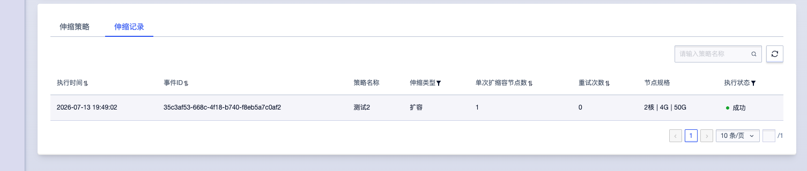

伸缩的记录在“伸缩记录”tab中查看

## 自动扩容节点查看

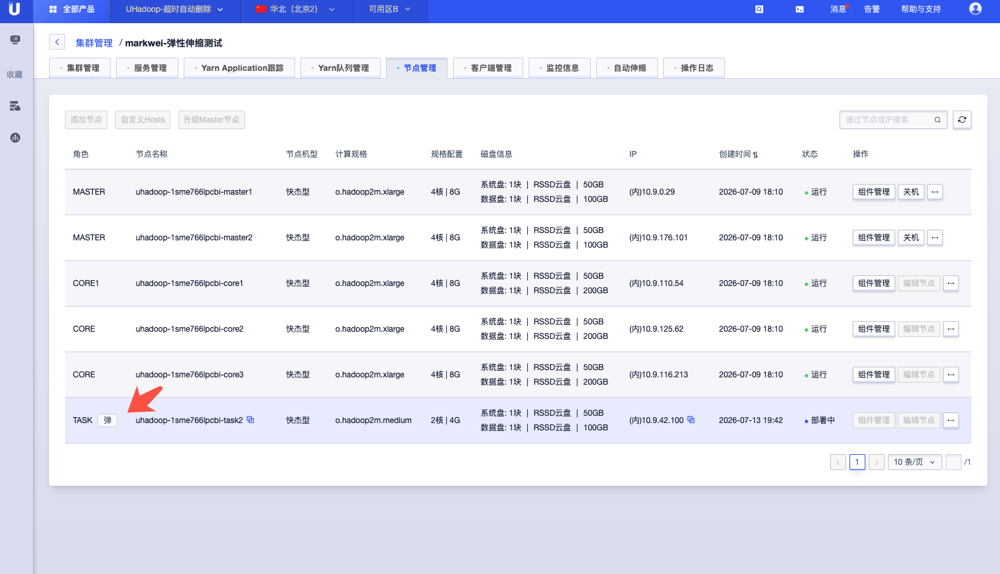

在节点列表中，自动扩容的节点，角色后方会以“弹”标签来展示。

