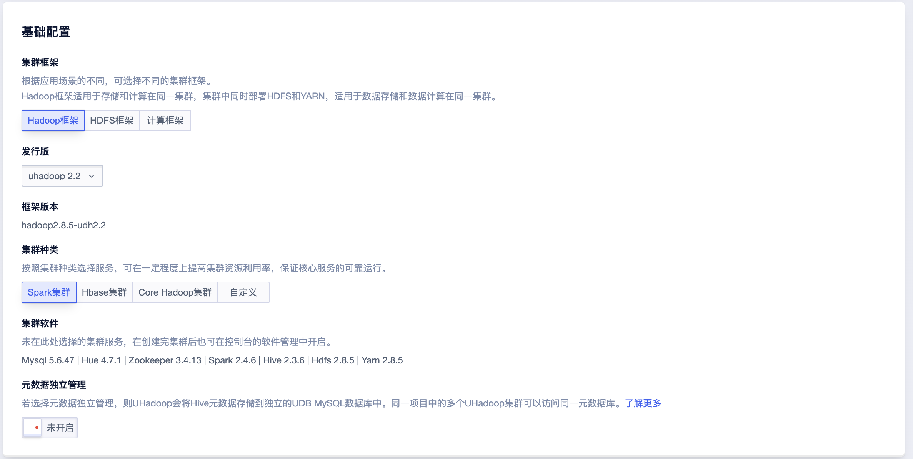
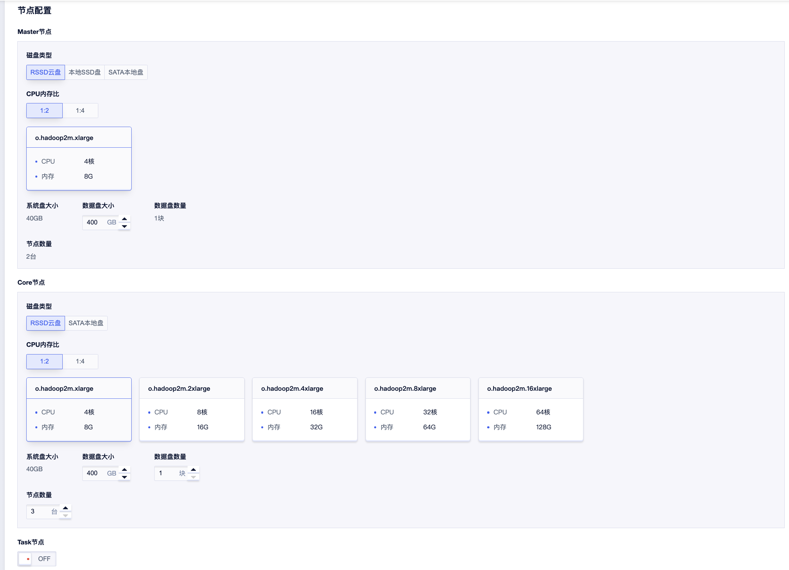

# 集群创建

可在列表页点击“创建集群”按钮进入创建页面进行集群创建：

## 基础配置

- 集群框架：根据应用场景的不同，可选择不同的集群框架。

    - Hadoop框架：集群中同时部署HDFS和YARN，适用于存储和计算在同一集群。

    - HDFS框架：集群中仅部署HDFS。用于做存储集群，有专属的HDFS节点机型。

    - 计算框架：不部署HDFS，仅部署YARN。

    HDFS框架和计算框架适用于存储计算分离架构。HDFS集群可作为多个独立计算集群的存储集群。
    计算集群和存储集群（Hadoop框架、HDFS框架）的关系是多对一。可以在集群详情页看到已经联通的集群。

- 发行版：发行版命名方式：uhadoop \[ 版本号 \]，每个发行版中有多个大数据生态软件，如HBase、Spark、Hive等。

- 框架版本：集群中 Hadoop 的版本，不同发行版的框架版本不同。

- 集群种类：不同种类代表集群会安装不同的集群软件。未在此处选择的软件，也可在集群创建完成后，通过集群管理添加。

- 元数据独立管理：若选择元数据独立管理，则UHadoop会将Hive元数据存储到独立的UDB MySQL数据库中。同一项目中的多个UHadoop集群可以访问同一元数据库。

## 节点配置

集群包括Master、Core、Task三类节点，具体说明如下：

- Master节点：管理节点，负责协调整个集群服务。一个集群中有且仅有两个管理节点，一主一备，保证高可用。
  除了基础服务（如Hadoop、Hive、HBase）的管理端部署在Master上外，一些插件（如Hue、Oozie、Sqoop2、Airflow）也会安装于Master节点上。

- Core节点：核心节点，用于存储数据（HDFS）与运行任务。由于核心节点用于存储数据，因此数量须大于等于2（默认集群文件副本数配置为3），您可以根据业务需求添加更多的核心节点。其中Core1节点兼具管理节点特性，部署Zookeeper等服务，操作时需要留意。

- Task节点：任务节点，用于执行任务。任务节点不存储数据，您可以在集群运行期间动态进行添加和删除。

根据用户实际场景按需进行节点配置，节点支持动态扩缩容、纵向升配与存储扩容，也可在集群使用过程中动态调整集群规格。