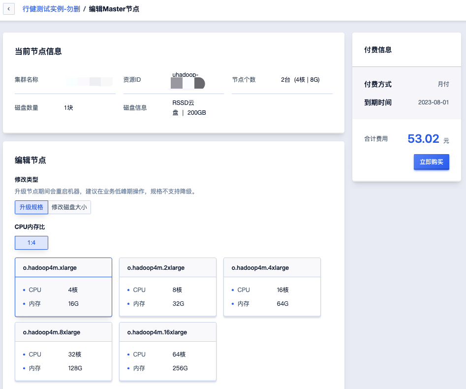
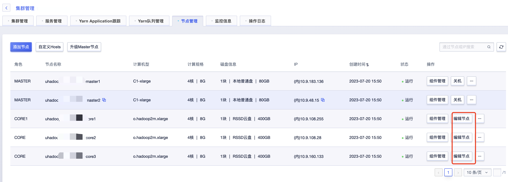
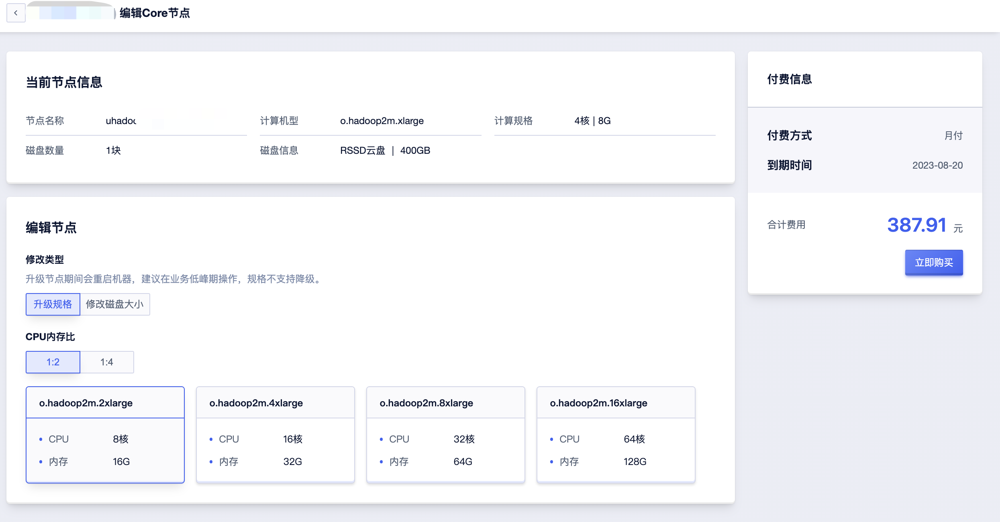
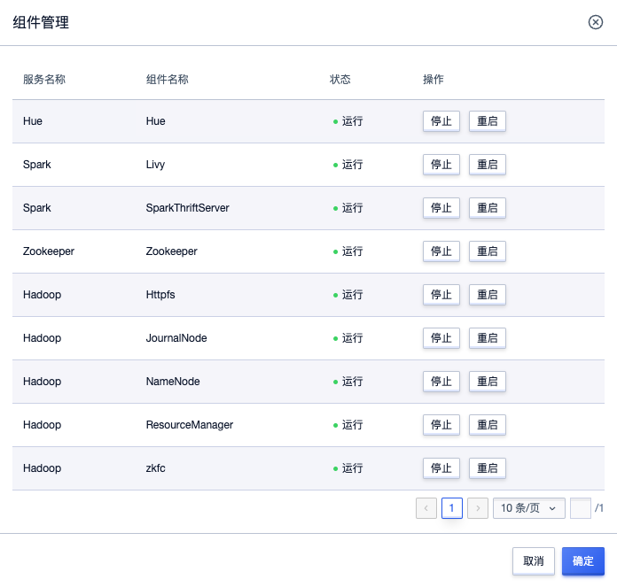

# 节点操作

UHadoop提供多种节点操作，可根据不同场景选择操作。

## 添加节点

支持Core与Task节点添加，可点击“添加节点”按钮进入添加页面:

在添加节点页面，可配置节点类型、磁盘类型、节点规格、磁盘信息、节点个数等信息完成节点添加，等待节点创建完成之后便可使用新的节点。

注意：新增Core节点需要执行数据均衡操作，具体见[数据均衡](../instance/balance.md)

## 节点升级

### Master节点升级

Master节点升级会对集群所有Master节点进行操作，可点击“升级Master节点”进入升级页面：

Master升级支持升级规格与修改磁盘大小两种操作，说明如下：

* 升级规格：修改所有Master节点CPU/内存配置，升级节点期间会重启机器，建议在业务低峰期操作，规格暂不⽀持降级。

* 修改磁盘大小：修改所有Master节点磁盘大小，升级期间节点无需重启，仅新机型支持该操作，具体见前端操作限制。

### Core/Task节点升级

Core与Task节点支持单个节点维度升级，可选择对应节点点击“编辑节点”进入升级页面：

Core/Task升级支持升级规格与修改磁盘大小两种操作，说明如下：

* 升级规格：修改操作节点CPU/内存配置，升级节点期间会重启机器，建议在业务低峰期操作，规格暂不⽀持降级。

* 修改磁盘大小：修改操作节点磁盘大小，升级期间节点无需重启，仅新机型支持该操作，具体见前端操作限制。

## 组件管理

选择指定节点点击“组件管理”可查看节点上部署组件信息:

对每个组件可进行停止、启动、重启操作:

## EIP绑定

可对节点进行EIP绑定/解绑操作，以开启或者关闭节点外网访问权限，仅支持对Master节点进行该操作。

## 防火墙绑定

可对节点进行防火墙绑定，已设置节点访问策略，仅支持对Master节点进行该操作。

## 节点删除

Master节点不支持，仅支持Core节点与Task节点删除。

### 删除Core节点

Core节点最小数量为3，当Core节点数量大于3时才可支持删除操作，其中Core1节点为特殊节点不允许删除。

(TODO)

### 删除Task节点

(TODO)